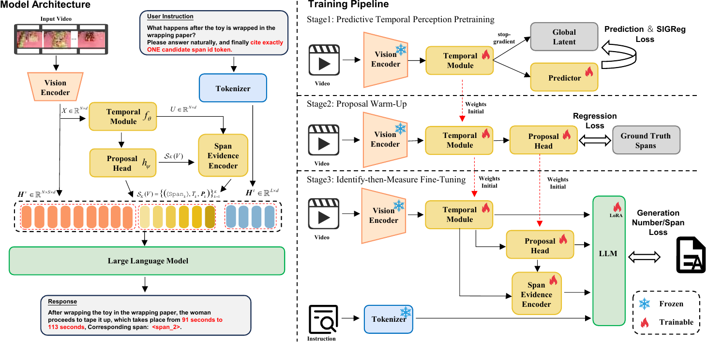

# Foresee-to-Ground: From Predictive Temporal Perception to Evidence-Driven Reasoning for Video Temporal Grounding

## News
- 2026-05-01: Foresee-to-Ground was accepted to ICML 2026.

## Overview

In this work,

- We introduce **Foresee-to-Ground (F2G)**, a video temporal grounding framework that makes segment-level evidence explicit and enables verifiable grounding by associating each boundary prediction with a supervised evidence citation.
- We develop **Predictive Temporal Perception** to extract a compact, ranked evidence pool of candidate event segments from untrimmed videos.
- We propose **Evidence-Driven Reasoning**, which augments the LLM input with citable evidence units and implements **Identify-then-Measure** through joint span-ID and timestamp supervision.

<p align="center">
  
</p>

### Framework at a Glance

F2G is organized as a three-stage training pipeline:

| Stage | Role | Public Entry |
| --- | --- | --- |
| Stage 1 | Learn boundary-sensitive temporal perception from unlabeled clips | `stage1/train_stage1.py` |
| Stage 2 | Warm up proposal generation and construct the evidence pool | `stage2/train_stage2.py` |
| Stage 3 | Perform evidence-driven grounding with span-aware prompting | `stage3/train_stage3.py` |

This public release also includes:

- a plain **Qwen3-VL SFT baseline** under `qwen3vl_sft/`
- annotation **schemas and expected paths** under `data/`
- **TimeLens conversion tools** under `tools/`

## Quick Start

### 1. Create the environment

Use the exported `numpro` environment for the closest reproduction:

```bash
conda env create -f environment.yml
conda activate numpro
```

If you prefer a lighter setup:

```bash
conda env create -f environment.min.yml
conda activate numpro
pip install -r requirements.txt
```

### 2. Prepare the data layout

This repository includes the public codebase and data layout templates, but not raw videos, large annotation files, or checkpoints.

Place videos under the following directories:

```text
data/videos/anet/
data/videos/didemo/
data/videos/internvid/
data/videos/timelens_100k_336/
data/videos/timelens_bench_336/
```

Stage-1 pretraining expects short clips under:

```text
data/stage1/clips/
```

Large annotation files will be released later on **Hugging Face** together with the model checkpoints. The expected local paths are still:

```text
data/annotations/
data/annotations/timelens/
```

For dataset download links, see [Dataset sources](#dataset-sources) below.

### 3. Run the F2G pipeline

```bash
bash scripts/stage1/train_stage1.sh
bash scripts/stage2/train_stage2.sh
bash scripts/stage3/train_stage3.sh
bash scripts/stage3/train_stage3_timelens.sh
```

### 4. Run the plain Qwen3-VL baseline

```bash
bash scripts/baseline/train_qwen3vl_sft.sh
bash scripts/baseline/eval_qwen3vl_sft.sh
```

## Repository Structure

```text
Foresee-to-Ground/
├── data/                 # released annotations and expected data layout
├── tools/                # offline preprocessing and conversion scripts
├── scripts/              # runnable shell entrypoints
├── stage1/               # predictive temporal perception
├── stage2/               # proposal warm-up
├── stage3/               # evidence-driven reasoning
├── qwen3vl_sft/          # plain Qwen3-VL baseline
├── paper/                # paper LaTeX source
├── environment.yml       # exported numpro Conda environment
├── environment.min.yml   # minimal Conda history export
└── requirements.txt      # pip-style dependency file
```

## Data Preparation

### Dataset sources

This repository releases preprocessing code and data layout templates. Large annotation files will be released later on **Hugging Face** together with the checkpoints. Raw videos should be obtained from the public sources below.

### Main benchmarks via NumPro

The main F2G training and evaluation data, except for TimeLens, follow the public NumPro data organization:

- NumPro repository: [yongliang-wu/NumPro](https://github.com/yongliang-wu/NumPro)
- NumPro training instructions: [Google Drive file](https://drive.google.com/file/d/1X4VSdSpGEBeRDVGaZq6HsUjJxUj88jDc/view?usp=sharing)
- NumPro 1 FPS training videos: [Hugging Face dataset](https://huggingface.co/datasets/Liang0223/NumPro_FT)

### TimeLens

For TimeLens-100K training data and TimeLens-Bench evaluation data, use the official TimeLens release:

- TimeLens repository: [TencentARC/TimeLens](https://github.com/TencentARC/TimeLens)
- TimeLens model and data collection: [Hugging Face collection](https://huggingface.co/collections/TencentARC/timelens)

### TimeLens conversion

The public release includes the scripts used to build the TimeLens training and evaluation files:

- `tools/build_timelens_stage3_json.py`
- `tools/build_timelens_bench_test_json.py`
- `tools/resize_timelens_videos_336.py`

For the expected local directory layout, see:

- `data/README.md`
- `data/raw/README.md`

## Training

### F2G mainline

Run the stages in order:

1. prepare Stage-1 clips
2. train Stage-1 temporal perception
3. train Stage-2 proposal warm-up
4. train Stage-3 evidence-driven grounding

### Qwen3-VL SFT baseline

The baseline is intentionally simple:

- `qwen3vl_sft/train.py` trains a plain Qwen3-VL SFT model on the released single-turn grounding data
- `qwen3vl_sft/eval/run_eval.py` produces predictions
- `qwen3vl_sft/eval/score_results.py` computes temporal grounding metrics

## Evaluation

### F2G

The public Stage-3 evaluation entrypoint is:

```text
stage3/eval/run_eval.py
```

### Plain Qwen3-VL baseline

The public baseline evaluation entrypoints are:

```text
qwen3vl_sft/eval/run_eval.py
qwen3vl_sft/eval/score_results.py
```


## Environment Notes

- `environment.yml` is the exported snapshot of the active `numpro` Conda environment.
- `requirements.txt` is a convenient pip-style companion, not the authoritative reproduction file.
- `sitecustomize.py` provides compatibility shims for Torch environments missing pytree registration helpers or compiler helpers expected by downstream libraries.

## Citation

If this repository is useful in your research, please cite the F2G paper.

```bibtex

```


## Acknowledgements

We thank the following projects: [Qwen3-VL](https://github.com/QwenLM/Qwen3-VL), [NumPro](https://github.com/yongliang-wu/NumPro), [TimeLens](https://github.com/TencentARC/TimeLens)
